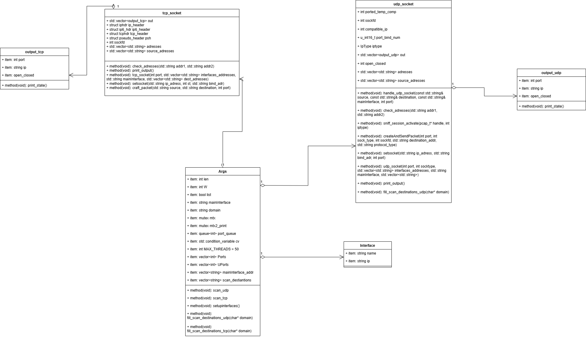
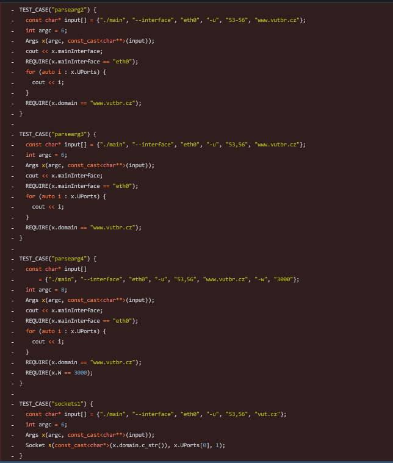
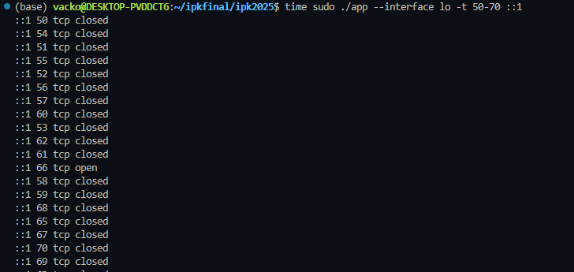
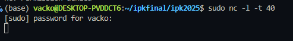
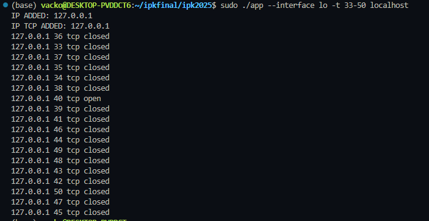

# IPK Project Omega: L4 port scanner

## Introduction

This document is a documentation for my implementation of assignment OMEGA, for subject IPK.
It will briefly describe the initial design of the application, what was changed during development and why. It will also describe possible ways to improve the application and what was tested.

The active coding time is 63 hours, while many other hours have been invested in reading resources and relevant materials.

## Chapters

### Structure

- Initial Design
- Argument Parser
- TCP Scan implementation details
- UDP Scan implementation details
- Testing
- Bibliography

## Initial Design

Originally, the project structure was designed to be only 3 files (argpars, help, scanner), and there were many more objects present in the class diagram. However, because of my inexperience with network programming, a lot of changes have been made. You can see the current composition of the program below:



There are two main things I would pinpoint as needing improvement. First, the classes are very **strict**, meaning they don't offer many public methods. This can lead to worse scalability of the program and user inputs.

The second one is that certain objects are doing more than they should. For example, it is questionable whether the class Args should have methods `scan_tcp` and `scan_udp`. However, this was a decision that had to be made for a clearer approach.

The classes for output have been made to support multithreading.

## Argument Parser and Program options

The argument parser, implemented in the `Args` class, is responsible for processing command-line inputs to configure the L4 port scanner. It validates and extracts the target domain/IP, ports to scan, timeout, and network interface settings. The program **NEEDS to be run with sudo privilages, otherwise it causes error**.

### Supported Options after running make

- **`-i, --interface`**  
  Specifies the network interface (e.g., `eth0`) to use. If omitted or invalid, the available interfaces are listed.

- **`-t, --pt`**  
  Specifies TCP port(s) to scan. Accepts a single port (e.g., `80`), a comma-separated list (e.g., `80,443`), or a range (e.g., `80-90`). The program **DOES NOT** support comma-separated lists in combination with a range.

- **`-u, --pu`**  
  Specifies UDP port(s) to scan, with the same format as TCP ports.

- **`-w, --wait`**  
  Sets the timeout (in milliseconds) for the scan. The default value used is 3000 as required in the assignment.

- **Target Domain/IP**  
   The final argument (not associated with any flag) is used as the target for the scan. Through this argument, the user gets all the IPs that need to be scanned.

### Example Usage

```bash
./main -i eth0 -t 80,443 -w 5000 www.example.com
```

- **`-i eth0`**: Use the `eth0` network interface.
- **`-t 80,443`**: Scan TCP ports 80 and 443.
- **`-w 5000`**: Set the scan timeout to 5000 milliseconds.
- **`www.example.com`**: Target domain or IP address.

### Argument Parser Testing

Because the initial stage of development was done in an environment from **Mata** library from **Verifit**, the tests were later deleted after they had been passed. The tests can be found in the Gitea repository. Listed below are some of the tests. I do not consider them as important as the scanning ones, therefore I provide only a screenshot.



## TCP Scan Implementation Details

TCP scanning is multithreaded. For each port (maximum running 50 at a time), it instantiates a class called **socket_tcp**. The constructor takes care of all the scanning. When the constructor finishes, the results of the scanning can be found in a class **output_tcp**. To prevent printing in multiple threads, all threads are joined after every single one of them is done. Then, using a mutex to prevent errors, we print all of the scan results.

Catching packets is done with the function `recvfrom()`. The function **should not** cause busy waiting; however, that needs to be tested.

Packet crafting was done with the help of **netinet** headers, which provide structures for header files.

The checksum function, after many unsuccessful attempts, was generated using ChatGPT with the prompt: _Can you generate me a C++ checksum function for sending raw packets?_

## UDP Scan Implementation Details

UDP scanning is multithreaded. For each port (maximum running 50 at a time), it creates a class called **socket_udp**. The way it gets results is similar to **tcp**.

It does not send raw packets; instead, it sends a normal one and catches packets using the `pcap` library for ICMP responses.

To make sure that the packet is not sent before the sniffing session is activated, we create two threads and delay the thread that sends the packet for a short amount of time so that the sniffing session will be activated and the packet will be caught.

During development, I had many problems with exiting the catching loop. The `pcap_set_timeout` function does not guarantee return after the time elapsed. That is why I decided to busy wait. Later, I found that maybe it can be avoided by using different functions in the catching loop, so for future work, looking at functions **pcap_loop** or **pcap_dispatch** is appropriate.

However, the multithreading approach seems to speed up scanning quite significantly.
During intensive testing, I discovered that the `pcap` library is not a big friend of threads. In one scan where I scanned 20,000 ports, it falsely marked 7 ports as **open**. This was due to its inability to catch the required packet. This didn’t happen with a non-multithreaded version of the program, which I decided I would not submit, but it seems to be more accurate by a small margin.

## Testing

In this section, I want to provide screenshots from testing. The tools used were: Wireshark on Linux, run with `sudo wireshark`, netcat to open local ports, and FIT OPEN VPN to get an IPv6 address. During development, other tools were used, such as hexdumping incoming packets or standard prints into the terminal. Here are the screenshots of some tests.






The tests were then checked with Wireshark as well.

The only thing that did not make sense during testing is that FIT VPN worked weirdly. When scanning TCP IPv6 through interface `tun0`, I always got all filters open, which aligned with what Wireshark was saying. I do not know the cause of these problems.

The application was also tested with valgrind leakcheak full and the app does not seem to be leaking with correct usage.

## Bibliography

- [ChatGPT] OpenAI. Assisted in generating the checksum function and Makefile. Assisted in checking typos in my Readme.md file [online]. [cited 2024-02-11]. Available at: https://openai.com/chatgpt
- [RFC793] Postel, J. Transmission Control Protocol. [online]. September 1981. Available at: https://www.ietf.org/rfc/rfc793.txt
- [GeeksforGeeks] Multithreading in C++. [online]. Available at: https://www.geeksforgeeks.org/multithreading-in-cpp/
- [TCPDump] pcap catching loop initialization for UDP scanning. [online]. Available at: https://www.tcpdump.org/pcap.html
- [Beej's Guide] Socket initialization, getaddrinfo to get IPs of scanning addresses. Also mentioned when i used code for getaddrinfo in code. [online]. Available at: https://beej.us/guide/bgnet/html/#socket
- [WinPcap] pcap functions. [online]. Available at: https://www.winpcap.org/docs/docs_412/html/group__wpcapfunc.html#ga3f212141c80b59aad8ac535bb0178275
